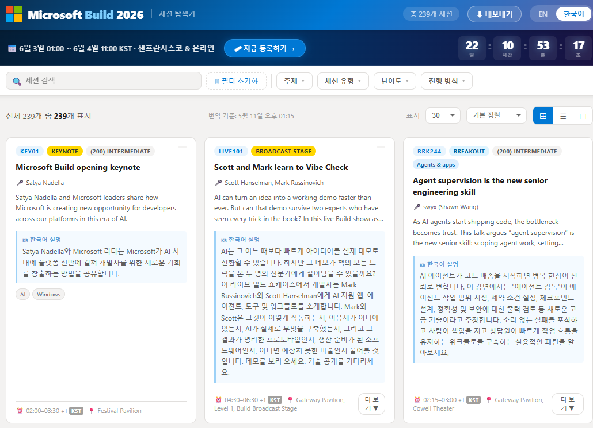

# Microsoft Build 2026 — Session Navigator

Microsoft Build 2026 세션 카탈로그를 빠르게 탐색할 수 있는 Single-Page Application입니다.

**GitHub**: [https://github.com/wonsungso/msbuildsessionnavigator](https://github.com/wonsungso/msbuildsessionnavigator)



## 주요 기능

| 기능 | 설명 |
|------|------|
| **세션 탐색** | 세션을 그리드 / 리스트 / 테이블 뷰로 전환 |
| **검색** | 제목 · 영문 설명 · 한국어 설명 동시 검색 |
| **다중 필터** | Topic / Session Type / Level / Delivery 복수 선택 |
| **정렬** | 기본 / 제목순 / 난이도 / 유형 / 시간순 |
| **페이지당 수 조절** | 12 / 24 / 30 / 60 / All |
| **시간대 표시** | EN 모드 → UTC, 한국어 모드 → KST (자정 초과 시 +1 표시) |
| **한국어 UI** | 전체 UI + 세션 설명 한국어 지원 (Google Translate 기계번역) |
| **xlsx 내보내기** | 현재 필터 결과를 엑셀 파일로 다운로드 (SheetJS) |
| **자동 갱신** | 서버가 7일마다 MS Build API에서 세션 데이터 자동 갱신 |
| **카운트다운** | 행사 시작까지 남은 일/시/분/초 실시간 표시 |

## 시작하기

### 요구사항

- **Python 3.8+** (없으면 `run.sh`가 자동 설치 시도)
- `requests` 패키지 (없으면 `run.sh`가 자동 설치)
- Bash 환경 (macOS / Linux / Windows Git Bash / WSL)

### 소스 받기

```bash
git clone https://github.com/wonsungso/msbuildsessionnavigator.git
cd msbuildsessionnavigator
```

### 서버 실행

```bash
sudo bash run.sh
```

- Python / pip / requests 설치 여부를 자동 확인하고 필요 시 설치합니다.
- SSL 인증서가 있으면 HTTPS(443), 없으면 HTTP(80)으로 기동됩니다.
- HTTP(80)로 접속하면 자동으로 HTTPS(443)로 리다이렉트됩니다.
- 멀티스레드(`ThreadingTCPServer`)로 동시 요청을 처리합니다.
- 백그라운드 스레드가 **매일 갱신 여부를 확인**하고, 마지막 갱신 후 **7일이 경과**하면 세션 데이터와 한국어 번역을 자동 갱신합니다.
- PID 파일(`.server.pid`)로 중복 실행을 방지합니다.

### 서버 종료

```bash
sudo bash stop.sh
```

### 서버 재시작

```bash
sudo bash restart.sh
```

### 브라우저에서 열기

```
https://<your-domain>   # SSL 인증서 적용 시
http://localhost        # 로컬 테스트 시
```

### SSL 인증서 설치 (Let's Encrypt)

서버에서 아래 명령을 한 번만 실행하면 무료 SSL 인증서를 발급받습니다:

```bash
# certbot 설치 (snap)
sudo snap install core && sudo snap refresh core
sudo snap install --classic certbot
sudo ln -s /snap/bin/certbot /usr/local/bin/certbot

# 인증서 발급 (standalone 모드 — 서버 실행 중지 후 실행)
sudo bash stop.sh
sudo certbot certonly --standalone -d <your-domain>

# server.py의 SSL_CERT / SSL_KEY 경로를 도메인에 맞게 수정 후 재시작
sudo bash run.sh
```

인증서는 90일마다 갱신이 필요합니다. 실제 갱신이 발생한 경우에만 서버가 재시작되도록 `--deploy-hook`을 사용하세요:

```bash
# crontab -e 에 아래 줄 추가 (매일 새벽 3시 갱신 확인, 갱신 시에만 재시작)
0 3 * * * certbot renew --quiet --deploy-hook "bash /path/to/restart.sh"
```

## 파일 구조

```
MsBuildNavigator/
├── index.html          # SPA 전체 (HTML + CSS + JS)
├── server.py           # Python HTTP 서버 + 자동 갱신 + 번역
├── run.sh              # 서버 시작 (Python 자동 설치 포함)
├── stop.sh             # 서버 종료
├── restart.sh          # 서버 재시작
├── source/
│   ├── sessions.json     # MS Build API에서 받은 세션 데이터 (자동 생성, git 제외)
│   └── sessions_kr.json  # 한국어 번역 캐시 (자동 생성, git 제외)
└── imgs/
    └── microsoft_icon.png
```

## 데이터 갱신 방식

```
서버 시작
  └─► source/sessions.json 로드
  └─► source/sessions_kr.json 로드 (한국어 번역 캐시)
  └─► 백그라운드 스레드 시작
        └─► 24시간마다 확인: sessions_kr.json이 7일 이상 됐으면
              └─► MS Build API 호출 → sessions.json 갱신
              └─► 신규/변경 세션 설명 Google Translate → sessions_kr.json 갱신
```

번역은 `https://translate.googleapis.com` 무인증 엔드포인트를 사용합니다.
정확도가 중요한 경우 원문(영어)을 우선 확인하세요.

## 주요 단축키 / 조작

| 동작 | 방법 |
|------|------|
| 홈으로 이동 | 헤더 로고 클릭 |
| 필터 초기화 | 🗑 Clear Filters 버튼 |
| 언어 전환 | 우상단 EN / 한국어 버튼 |
| 뷰 전환 | ⊞ 그리드 / ☰ 리스트 / ▤ 테이블 |
| 엑셀 내보내기 | ⬇ Export 버튼 (현재 필터 결과만) |

## 기술 스택

- **Frontend**: Vanilla HTML / CSS / JavaScript (프레임워크 없음)
- **Backend**: Python `http.server` + `ThreadingTCPServer` (표준 라이브러리)
- **번역**: Google Translate 무인증 API
- **Excel 내보내기**: [SheetJS](https://sheetjs.com/) CDN
- **데이터 출처**: `https://api-v2.build.microsoft.com/api/session/all`

## 라이선스

개인 학습 및 편의 목적의 비공식 도구입니다.
세션 데이터의 저작권은 Microsoft에 귀속됩니다.
